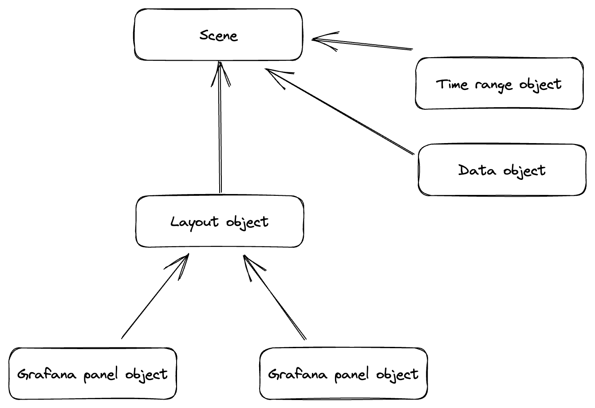

## Scene

Scene is a collection of objects, called scene objects. These objects represent different aspects of the Scene: data, time ranges, variables, layout, visualizations. Combined together, scene objects form an object tree.



Scene allows to group and nest object. Things like data, time range or variables can be added to any object in the tree, making them accessible to that object and all descendant objects. Thanks to this, Scene allows to create dashboards that have multiple time ranges, queries that can be shared and transformed, or nested variables.

@grafana/scenes comes with multiple objects to solve common problems, like `SceneQueryRunner`, `SceneFlexLayout`, `VizPanel` and more. But you can also create your own scene objects to extend the functionality.

## Scene object

Scene is built from atomic objects called scene objects. Here's an example of a simple Counter scene object:

```tsx
import React from 'react';
import { SceneObjectState, SceneObjectBase, SceneComponentProps } from '@grafana/scenes';

// 1. Create interface that describes state of the scene object
interface CounterState extends SceneObjectState {
  count: number;
}

// 2. Create a scene object
export class Counter extends SceneObjectBase<CounterState> {
  public static Component = CounterRenderer;

  public constructor() {
    super({
      count: 0,
    });
  }

  public onIncrement = () => {
    this.setState({
      count: this.state.count + 1,
    });
  };
}

// 3. Create a component that renders and interacts with the scene object
function CounterRenderer({ model }: SceneComponentProps<Counter>) {
  const { count } = model.useState();

  return (
    <div>
      <div>Counter: {count}</div>
      <button onClick={model.onIncrement}>Increase</button>
    </div>
  );
}
```

## State

Scene object can have a state. The shape of object's state is expressed via an interface that _must_ extend `SceneObjectState` interface:

```tsx
interface CounterState extends SceneObjectState {
  count: number;
}
```

### Subscribing to state changes

The component can read the state from scene object by using `model` prop that it receives when rendered. To subscribe to state changes, call `model.useState` method.

```tsx
function CounterRenderer({ model }: SceneComponentProps<Counter>) {
  const { count } = model.useState();

  // ...
}
```

Subscribing to object's state using `model.useState()` will make the component reactive to state changes. Every change to the scene object state is immutable and will cause a re-render of the component.

### Modifying state

To change the state of the scene object, use `setState` method that each scene object has. This can be done directly from the component:

```tsx
function CounterRenderer({ model }: SceneComponentProps<Counter>) {
  const { count } = model.useState();
  const onIncrement = () => model.setState({ count: count + 1 });

  // ...
}
```

Or in the scene object implementation:

```tsx
export class Counter extends SceneObjectBase<CounterState> {
  // ...
  public onIncrement = () => {
    this.setState({
      count: this.state.count + 1,
    });
  };
}

function CounterRenderer({ model }: SceneComponentProps<Counter>) {
  const { count } = model.useState();

  return (
    <div>
      <div>Counter: {count}</div>
      <button onClick={model.onIncrement}>Increase</button>
    </div>
  );
}
```

:::note
We suggest to implement the state-modifying methods in the scene object rather than component to separate the model complexity from the component.
:::

## Data and time range

Use `$data` property to add data coming from Grafana data sources to a Scene. Queries are configured via `SceneQueryRunner` scene object.

```tsx
import { SceneQueryRunner } from '@grafana/scenes';

const queryRunner = new SceneQueryRunner({
  datasource: {
    type: 'prometheus',
    uid: '<PROVIDE_GRAFANA_DS_UID>',
  },
  queries: [
    {
      refId: 'A',
      expr: 'rate(prometheus_http_requests_total{}[5m])',
    },
  ],
});
```

:::info
Keep in mind that your Grafana instance must have specified data source configured.
:::

For `SceneQueryRunner` to work, a time range has to be added to a Scene. Each scene object has `$timeRange` property to which `SceneTimeRange` scene object can be added. To specify time range for the query runner created in previous example, add `$timeRange` property in the object passed to the constructor:

```tsx
import { SceneQueryRunner, SceneTimeRange } from '@grafana/scenes';

const queryRunner = new SceneQueryRunner({
  datasource: {
    type: 'prometheus',
    uid: '<PROVIDE_GRAFANA_DS_UID>',
  },
  queries: [
    {
      refId: 'A',
      expr: 'rate(prometheus_http_requests_total{}[5m])',
    },
  ],
  $timeRange: new SceneTimeRange({ from: 'now-5m', to: 'now' }),
});
```

Add created `queryRunner` to your scene. Each object in the scene will now be able to access the provided data:

```ts
const scene = new EmbeddedScene({
    $data: queryRunner,
    body: ...
})
```

Each scene object has `$data` and `$timeRange` property that can be configured. Given that Scene is a objects tree, data provided via `SceneQueryRunner` and time range configured via `SceneTimeRange` is accessible to the object those are added to _and_ all descendant objects.

In the following example, each `VizPanel` use different data. Panel A uses data defined on the `EmbeddedScene`, while Panel B has it's own data and time range configured:

```tsx
// Scene data, used by Panel A
const queryRunner1 = new SceneQueryRunner({
  datasource: {
    type: 'prometheus',
    uid: '<PROVIDE_GRAFANA_DS_UID>',
  },
  queries: [
    {
      refId: 'A',
      expr: 'rate(prometheus_http_requests_total{}[5m])',
    },
  ],
  $timeRange: new SceneTimeRange({ from: 'now-5m', to: 'now' }),
});

// Panel B data
const queryRunner2 = new SceneQueryRunner({
  datasource: {
    type: 'prometheus',
    uid: '<PROVIDE_GRAFANA_DS_UID>',
  },
  queries: [
    {
      refId: 'A',
      expr: 'avg by (job, instance, mode) (rate(node_cpu_seconds_total[5m]))',
    },
  ],
});

const scene = new EmbeddedScene({
  $data: queryRunner1,
  body: new SceneFlexLayout({
    direction: 'row',
    children: [
      new SceneFlexItem({
        width: '50%',
        height: 300,
        body: new VizPanel({ title: 'Panel A', pluginId: 'timeseries' }),
      }),
      new SceneFlexItem({
        width: '50%',
        height: 300,
        body: new VizPanel({
          title: 'Panel B',
          pluginId: 'timeseries',
          $data: queryRunner2,
          // Time range defined on VizPanel objectt. queryRunner2 will use this time range.
          $timeRange: new SceneTimeRange({ from: 'now-6h', to: 'now' }),
        }),
      }),
    ],
  }),
});
```
